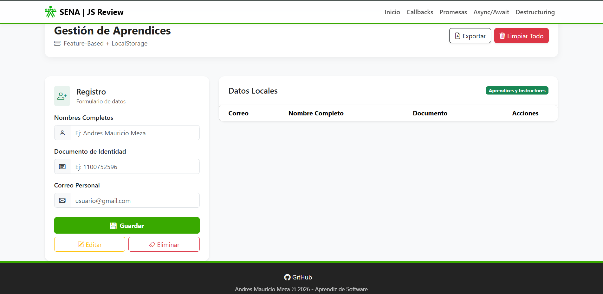

# Repaso JavaScript - LOCAL STORE 🛒

📌 **Descripción**

Este proyecto es una aplicación educativa enfocada en el dominio de **JavaScript moderno** y lógica de programación. Está diseñado para demostrar de manera práctica el manejo de procesos asíncronos, manipulación de datos y operaciones CRUD, manteniendo una estructura de archivos modular, limpia y profesional.

La aplicación está organizada por carpetas de funcionalidades para facilitar el aprendizaje y la escalabilidad del código.

✨ **Características principales**

- **Asincronía Avanzada:** Implementación de flujos con `Async/Await`, `Promises` y `Callbacks`.
- **Manipulación de Datos:** Uso de _Destructuring_ para un código más eficiente.
- **Gestión de Datos:** Lógica de un sistema `CRUD` para el manejo de información.
- **Estructura Modular:** Organización por carpetas de características (_Feature_) y recursos compartidos (_Shared_).
- **Interfaz Web:** Integración de lógica JavaScript con archivos HTML5 y CSS3 estructurados.

🖥️ **Módulos del Proyecto**

La aplicación se divide en los siguientes bloques de aprendizaje:

- **Async/Await** → Manejo moderno de peticiones y tiempos de espera.
- **Callbacks** → Entendimiento de funciones de orden superior.
- **CRUD** → Creación, lectura, actualización y eliminación de registros.
- **Destructuring** → Extracción ágil de datos de objetos y arreglos.
- **Promesas** → Gestión de flujos y estados (Pending, Resolved, Rejected).

🏗️ **Arquitectura del Proyecto (File Structure)**

Basado en la estructura actual del repositorio:

```text
LOCAL_STORE/
│
├── public/
│   └── images/
│       └──logosena.png
           └── image.png
             
│
├── src/
│   ├── Feature/                  # Módulos de funcionalidades
│   │   ├── asyncawait/
│   │   │   ├── async-wait.html
│   │   │   └── async-wait.js
│   │   ├── callbacks/
│   │   │   ├── callback.html
│   │   │   └── callbacks.js
│   │   ├── crud/
│   │   │   └── main.js
│   │   ├── destructuring/
│   │   │   ├── destructuring.html
│   │   │   └── destructuring.js
│   │   └── promesas/
│   │       ├── promesas.html
│   │       └── promesas.js
│   │
│   ├── shared/                   # Recursos globales
│   │   └── styles/
│   │       └── styles.css
│   │
│   └── index.html                # Punto de entrada principal
│
└── README.md
```

📂 Explicación de la estructura

public/: Contiene recursos estáticos como imágenes y logotipos.

src/Feature/: Contiene los módulos lógicos del proyecto. Cada subcarpeta incluye su archivo HTML y JS independiente para pruebas específicas.

src/shared/: Almacena los estilos CSS globales que unifican la apariencia visual.

index.html: Archivo principal que conecta o presenta los diferentes módulos.

🚀 Instalación y ejecución

Clona el repositorio:

Bash
git clone [https://github.com/drexmezadelaossa/Proyecto_react_N-1.git](https://github.com/drexmezadelaossa/Proyecto_react_N-1.git)
Ingresa al proyecto:

Bash
cd Proyecto_react_N-1
Ejecución:
Al ser un proyecto de JavaScript Vanilla, simplemente abre el archivo index.html en tu navegador o usa la extensión Live Server en VS Code.

 🖼️ Captura de pantalla



👨‍💻 Datos del Autor

Nombre: Andrés Meza

Programa: Desarrollo de Software / Frontend

Institución: SENA

Tecnologías: JavaScript ES6+, HTML5, CSS3

GitHub: @drexmezadelaossa

🔗 Repositorio oficial

Puedes ver el código fuente y actualizaciones aquí:

<https://github.com/drexmezadelaossa/Proyecto_react_N-1.git>
